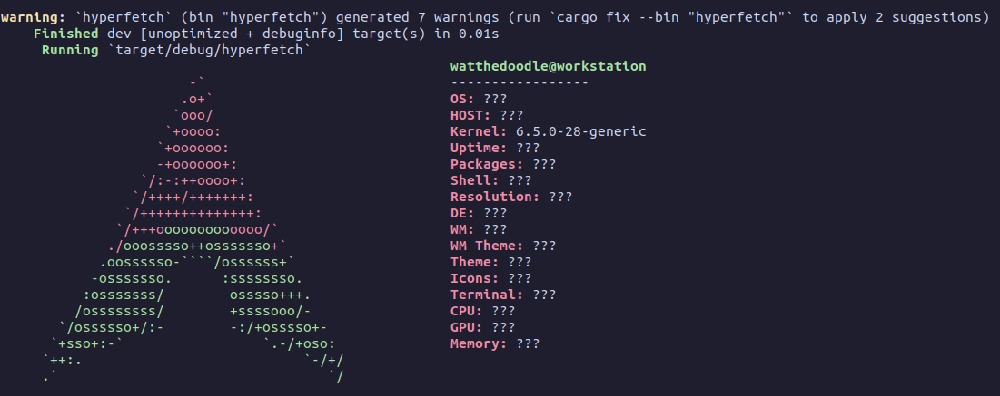

## Hyperfetch

A re-imagined version of `neofetch` rewritten in Rust 🦀

`neofetch` was archived on the 26th April 2024, I was intrigued by the source code of such a popular tool. It's an amazing 11K+ LoC bash script!

In trying to unpack the dense bash script, it got me thinking, what it would take to replicate a "mini neofetch" and hence `hyperfetch` was born!

## Screenshot WIP

## Building

TODO

## Version

0.1.0-ALPHA

## Contributing

1. Fork it (<https://github.com/watthedoodle/hyperfetch/fork>)
2. Create your feature branch (`git checkout -b my-new-feature`)
3. Commit your changes (`git commit -am 'Add some feature'`)
4. Push to the branch (`git push origin my-new-feature`)
5. Create a new Pull Request

## Contributors

- [watthedoodle](https://github.com/waththedoodle) Wat The Doodle - creator
